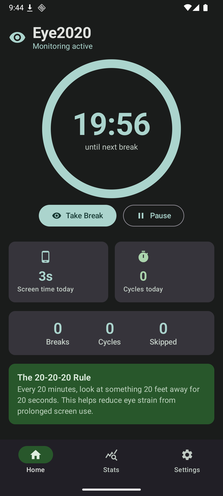
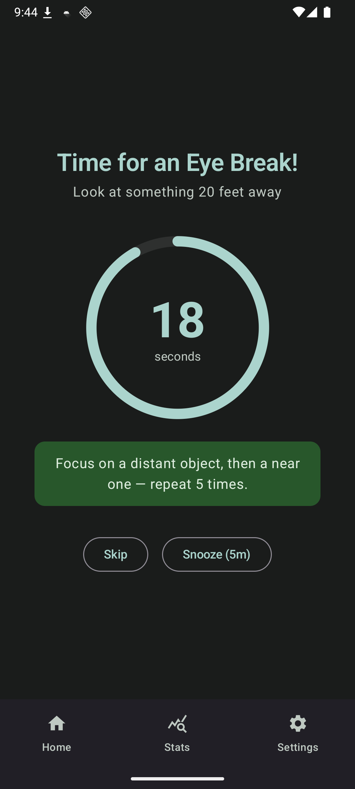
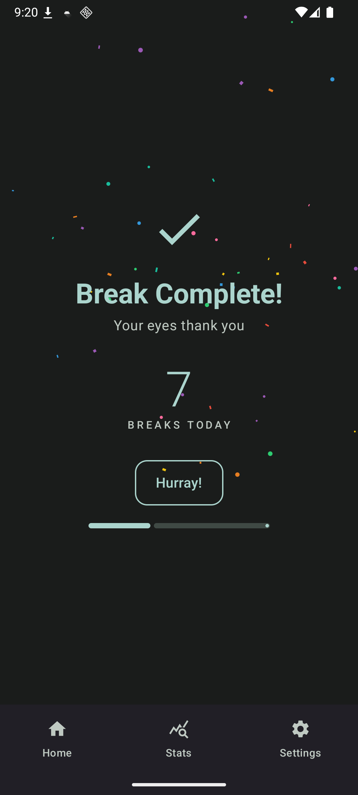
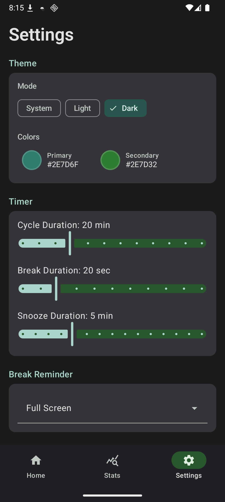
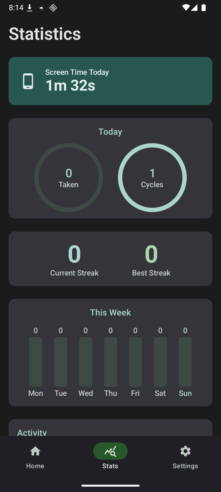

# Eye2020

An Android app that enforces the **20-20-20 rule** to reduce eye strain: every 20 minutes of screen usage, take a 20-second break and look at something 20 feet away.

## Features

- **Screen Time Monitoring** — Foreground service tracks screen usage with a 20-minute countdown timer
- **Break Reminders** — Configurable reminder modes: full-screen, overlay popup, notification, or silent
- **Daily Stats & Streaks** — Track breaks taken, skipped, and maintain daily streaks
- **Home Screen Widget** — Quick toggle and status at a glance
- **Auto-Start** — Monitoring starts automatically when the app opens
- **Boot Persistence** — Service restarts after device reboot
- **Theming** — System/Light/Dark mode with customizable primary & secondary accent colors
- **Break Celebration** — Confetti animation and sound on break completion
- **Snooze** — Configurable snooze duration to remind again later

## Screenshots

| HomePage | BreakPage | CompletePage |
|:---------:|:-----:|:--------:|
|  |  |  |

| SettingsPage | StatsPage |
|:--------:|:----------:|
|  |  |

## Tech Stack

| Component | Technology |
|---|---|
| UI | Jetpack Compose + Material 3 |
| Architecture | MVVM |
| DI | Koin |
| Database | Room |
| Preferences | DataStore |
| Widget | Glance |
| Navigation | Navigation Compose |
| Min SDK | 33 (Android 13) |
| Target SDK | 36 (Android 15) |

## Build

```bash
./gradlew assembleDebug       # Debug APK
./gradlew assembleRelease     # Signed release APK
./gradlew test                # Unit tests
./gradlew lint                # Lint checks
```

Release signing requires these properties in `local.properties`:

```properties
RELEASE_STORE_FILE=release-keystore.jks
RELEASE_STORE_PASSWORD=your_password
RELEASE_KEY_ALIAS=your_alias
RELEASE_KEY_PASSWORD=your_key_password
```

## Permissions

| Permission | Purpose |
|---|---|
| `POST_NOTIFICATIONS` | Break reminders and monitoring status |
| `FOREGROUND_SERVICE` | Background screen time monitoring |
| `RECEIVE_BOOT_COMPLETED` | Auto-start after reboot |
| `REQUEST_IGNORE_BATTERY_OPTIMIZATIONS` | Reliable background operation |
| `SYSTEM_ALERT_WINDOW` | Overlay popup break reminders |

## License

All rights reserved.
